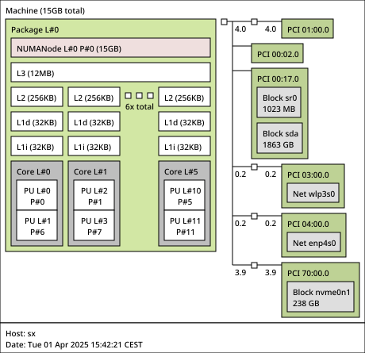
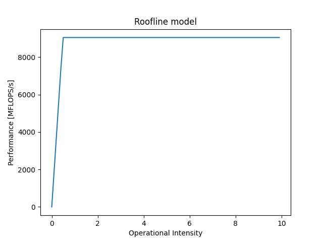

# HPC Lab 2 - Report
Author: Samuel Roland

## My code

Setup [Likwid](https://github.com/RRZE-HPC/likwid/) too. For this lab, I maintain both `CMakeLists.txt` and `xmake.lua`, but I use xmake generated binaries in my report.

### Via CMake
Setup the `fftw` library and `libsnd`, on Fedora here are the DNF packages
```sh
sudo dnf install fftw fftw-devel libsndfile-devel
```
Setup [Likwid](https://github.com/RRZE-HPC/likwid/) too.

Compile
```sh
cmake . -Bbuild && cmake --build build/ -j 8
```

And run the buffers variant
```sh
./build/dtmf_encdec_buffers decode trivial-alphabet.wav
```
Or run the fft variant
```sh
./build/dtmf_encdec_fft decode trivial-alphabet.wav
```

### Via Xmake
Install [xmake](https://xmake.io/#/getting_started)
```sh
curl -fsSL https://xmake.io/shget.text | bash
```
or via DNF
```sh
sudo dnf install xmake
```

Build the code, it will prompt you to install fft and libsnd dependencies on a global xmake cache
```sh
xmake
```

And run the buffers variant
```sh
xmake run dtmf_encdec_buffers decode trivial-alphabet.wav
# or directly
./build/linux/x86_64/release/dtmf_encdec_buffers decode trivial-alphabet.wav
```
Or run the fft variant
```sh
xmake run dtmf_encdec_fft decode trivial-alphabet.wav
# or directly
./build/linux/x86_64/release/dtmf_encdec_fft decode trivial-alphabet.wav
```

## My machine
I'm working on my tour at home, because my laptop is not supported by likwid because Intel 12th Gen is not supported currently. I asked about news for this support in their issues tracker on issue [Support for Intel Alder Lake 12th gen processors #468](https://github.com/RRZE-HPC/likwid/issues/468#issuecomment-2767312383).

Extract from `fastfetch` and manually completed
```
OS: Fedora Linux 41 (KDE Plasma) x86_64
Host: XPS 8930 (1.1.21)
Kernel: Linux 6.13.5-200.fc41.x86_64
CPU: Intel(R) Core(TM) i7-8700 (12) @ 4.60 GHz - Coffeelake
GPU 1: NVIDIA GeForce GTX 1060 6GB [Discrete]
GPU 2: Intel UHD Graphics 630 @ 1.20 GHz [Integrated]
Memory: 15.32 GiB - DDR4
Swap: 8.00 GiB
Disk: 236.87 GiB - btrfs
```



```
> likwid-topology 
--------------------------------------------------------------------------------
CPU name:	Intel(R) Core(TM) i7-8700 CPU @ 3.20GHz
CPU type:	Intel Coffeelake processor
CPU stepping:	10
********************************************************************************
Hardware Thread Topology
********************************************************************************
Sockets:		1
Cores per socket:	6
Threads per core:	2
--------------------------------------------------------------------------------
HWThread        Thread        Core        Die        Socket        Available
0               0             0           0          0             *                
1               0             1           0          0             *                
2               0             2           0          0             *                
3               0             3           0          0             *                
4               0             4           0          0             *                
5               0             5           0          0             *                
6               1             0           0          0             *                
7               1             1           0          0             *                
8               1             2           0          0             *                
9               1             3           0          0             *                
10              1             4           0          0             *                
11              1             5           0          0             *                
--------------------------------------------------------------------------------
Socket 0:		( 0 6 1 7 2 8 3 9 4 10 5 11 )
--------------------------------------------------------------------------------
********************************************************************************
Cache Topology
********************************************************************************
Level:			1
Size:			32 kB
Cache groups:		( 0 6 ) ( 1 7 ) ( 2 8 ) ( 3 9 ) ( 4 10 ) ( 5 11 )
--------------------------------------------------------------------------------
Level:			2
Size:			256 kB
Cache groups:		( 0 6 ) ( 1 7 ) ( 2 8 ) ( 3 9 ) ( 4 10 ) ( 5 11 )
--------------------------------------------------------------------------------
Level:			3
Size:			12 MB
Cache groups:		( 0 6 1 7 2 8 3 9 4 10 5 11 )
--------------------------------------------------------------------------------
********************************************************************************
NUMA Topology
********************************************************************************
NUMA domains:		1
--------------------------------------------------------------------------------
Domain:			0
Processors:		( 0 6 1 7 2 8 3 9 4 10 5 11 )
Distances:		10
Free memory:		1893.86 MB
Total memory:		15689.5 MB
--------------------------------------------------------------------------------
```

To sum up, CPU cache sizes for core 2
- L1: 32KB
- L2: 256KB
- L3: 12MB shared

```
> likwid-bench -p
Number of Domains 5
Domain 0:
	Tag N: 0 6 1 7 2 8 3 9 4 10 5 11
Domain 1:
	Tag S0: 0 6 1 7 2 8 3 9 4 10 5 11
Domain 2:
	Tag D0: 0 6 1 7 2 8 3 9 4 10 5 11
Domain 3:
	Tag C0: 0 6 1 7 2 8 3 9 4 10 5 11
Domain 4:
	Tag M0: 0 6 1 7 2 8 3 9 4 10 5 11
```

My machine has one physical socket, and I'm going to take domain 0 as recommended by the teacher, so with tag `N`.

## Preparation

I'm using the `txt/base.txt` which contains the supported alphabet once and `txt/verylong.txt` file which contains 100 times the same string. Encoding the 2 files:

```sh
xmake run dtmf_encdec_fft encode $PWD/txt/verylong.txt $PWD/verylong.wav
xmake run dtmf_encdec_fft encode $PWD/txt/base.txt $PWD/base.wav
```

## Roofline
I'm following the [Tutorial: Empirical Roofline Model](https://github.com/RRZE-HPC/likwid/wiki/Tutorial%3A-Empirical-Roofline-Model) 

Before starting the maxperf and maxband search I tried to measure the peak memory used. I learned via [Stackoverflow](https://stackoverflow.com/questions/774556/peak-memory-usage-of-a-linux-unix-process) that `time -v` can be used to get this information.

```sh
> /usr/bin/time -v ./build/linux/x86_64/release/dtmf_encdec_buffers decode $PWD/base.wav &| grep "Maximum resident set size"
	Maximum resident set size (kbytes): 27672
> /usr/bin/time -v ./build/linux/x86_64/release/dtmf_encdec_buffers decode $PWD/verylong.wav &| grep "Maximum resident set size"
	Maximum resident set size (kbytes): 569112
```
I know that my program is going way beyond the CPU cache available (27MB and 569MB are > 13Mb), so my roofline maxband is going to be tested on RAM access, not just CPU caches.

I chose to take my `buffers` decoder for this analysis, because it is faster than my `fft` decoder.

```
> time taskset -c 2 ./build/linux/x86_64/release/dtmf_encdec_buffers decode $PWD/verylong.wav > /dev/null
Executed in    3.12 secs
> time taskset -c 2 ./build/linux/x86_64/release/dtmf_encdec_fft decode $PWD/verylong.wav > /dev/null
Executed in    8.84 secs
```

### Searching for maxperf
We want to skip the first 0 and 1 physical threads used by the OS, so we pin the program on the thread number 2 with `taskset -c 2` as my program is single-threaded. I verified with `htop` that this is going on the physical thread 2, and not the physical core 2 which would be another one as my cores are hyperthreaded.

We run the `peakflops_sp` (single precision because my code only use `float` and no `double`). Using 16KB because this is the < 32KB from the L1 data cache size, we don't want to go further because we don't want our measures to be influenced by cache misses as we are not calculating the memory bandwidth here. Using the half size would be We want to use only 1 thread in the benchmark with `:1`.

Executing the `peakflops_sp` benchmark 4 times, gives me a maximum rounded `maxperf` of **9050 MFlops/s**
```sh
> taskset -c 2 likwid-bench -t peakflops_sp -W N:16kB:1 &| grep "MFlop"
MFlops/s:		9005.55
> taskset -c 2 likwid-bench -t peakflops_sp -W N:16kB:1 &| grep "MFlop"
MFlops/s:		8847.71
> taskset -c 2 likwid-bench -t peakflops_sp -W N:16kB:1 &| grep "MFlop"
MFlops/s:		8726.52
> taskset -c 2 likwid-bench -t peakflops_sp -W N:16kB:1 &| grep "MFlop"
MFlops/s:		9050.15
```

Note: what I find strange is that using > L1 or < L1 size is actually not impacting the mflops result that much, sometimes it's even faster with > L1... Maybe the noise of other programs running on my tour, the CPU usage is shared, so it makes +-400 Mflops of variation...
```sh
> taskset -c 2 likwid-bench -t peakflops_sp -W N:16kB:1 &| grep "MFlop"
MFlops/s:		8726.52
> taskset -c 2 likwid-bench -t peakflops_sp -W N:180kB:1 &| grep "MFlop"
MFlops/s:		9043.92
```

### Searching for maxband

In lines of `likwid-bench -a` I found this benchmark, this is not in SP, but it should be okay. I don't see anything better for maxband.
```
copy - Double-precision vector copy, only scalar operations
```

I'm going to use a `500MB` as this approximately what requires `verylong.wav` to be decoded

```sh
> taskset -c 2 likwid-bench -t copy -W N:500MB:1 &| grep MByte
MByte/s:		18720.67
> taskset -c 2 likwid-bench -t copy -W N:500MB:1 &| grep MByte
MByte/s:		18464.36
> taskset -c 2 likwid-bench -t copy -W N:500MB:1 &| grep MByte
MByte/s:		18627.95
```
I got approximately **18600 MByte/s**

### Conclusion and roofline schema

Combining the maxperf = **9050 MFlops/s** and the maxband = **18600 MByte/s** gives us this roofline



## Profiling my code
Currently my code is compiled with GCC flags: `-O0 -g -fno-inline`.

There are different groups of counters that can be used, depending on the architecture and what likwid is supporting. The most useful for us is the `FLOPS_SP` and `MEM`. We can use them with `-g`. There is also the possibility to pin the program to a given physical thread with `-C 2`, as that's shorter than `taskset -c 2`, I'm using this option here.
```sh
> likwid-perfctr -a
...
FLOPS_SP	Single Precision MFLOP/s
...
MEM	Memory bandwidth in MBytes/s
...
```

```sh
> likwid-perfctr -C 2 -g FLOPS_SP ./build/linux/x86_64/release/dtmf_encdec_buffers decode verylong.wav &| grep '  SP \[MFLOP/s\]'
|       SP [MFLOP/s]      |   425.9479 |
> likwid-perfctr -C 2 -g MEM ./build/linux/x86_64/release/dtmf_encdec_buffers decode verylong.wav &| grep 'Memory bandwidth'
|    Memory bandwidth [MBytes/s]    |   665.5020 |
> taskset -c 2 hyperfine -M 3 './build/linux/x86_64/release/dtmf_encdec_buffers decode verylong.wav'
Benchmark 1: ./build/linux/x86_64/release/dtmf_encdec_buffers decode verylong.wav
  Time (mean ± σ):      3.102 s ±  0.089 s    [User: 2.876 s, System: 0.212 s]
  Range (min … max):    3.012 s …  3.189 s    3 runs
```

We can now put a baseline **425.9479 MFlops/s** and **665.5020 MBytes/s** on the roofline, the time is `3.1s`. The operationnal intensity is `425.9479 / 665.5020 = 0.64004`.


As we see, there is big room for improvement, we are far from the limit of CPU calculation limit (the horizontal bar) and we can progress towards the left by minimizing the number of flop per byte.


## Starting code optimisations
I'm going to do a few optimisations, measure their progress, document the ones that improved in a table and document how I managed to do them. Some improvements will be listed for future labs.

### Step 1
That's the current state, without modifications from the last release of lab01.

### Step 2 - Removing debug logs

Currently decoding `verylong.wav` prints `18307` lines for debugging... maybe this is taking a bit of time to compute these logs and send them.


I used a macro LOG that only does something when the `LOGGING` macro is defined, removing any logging code by default.
```c
// Macro made by Claude 3.5
#ifdef LOGGING
#define LOG(format, ...) printf("[LOG] " format, ##__VA_ARGS__)
#else
#define LOG(format, ...) ((void) 0)
#endif
```
Then I replaced any `printf()` occurence by `LOG()` call in `decoder.c`

```sh
> likwid-perfctr -C 2 -g FLOPS_SP ./build/linux/x86_64/release/dtmf_encdec_buffers decode verylong.wav &| grep '  SP \[MFLOP/s\]'
|       SP [MFLOP/s]      |   435.4236 |
> likwid-perfctr -C 2 -g MEM ./build/linux/x86_64/release/dtmf_encdec_buffers decode verylong.wav &| grep 'Memory bandwidth'
|    Memory bandwidth [MBytes/s]    |   664.4730 |
> taskset -c 2 hyperfine -M 3 './build/linux/x86_64/release/dtmf_encdec_buffers decode verylong.wav'
Benchmark 1: ./build/linux/x86_64/release/dtmf_encdec_buffers decode verylong.wav
  Time (mean ± σ):      3.100 s ±  0.101 s    [User: 2.867 s, System: 0.221 s]
  Range (min … max):    3.035 s …  3.217 s    3 runs
```
The Operationnal Intensity has improved a bit: 0.655292, the flops counter has increase just a bit.


### Step 3 - Let the compiler optimize things for us

We can change `-O0 -g -fno-inline` to `-O2` to enable the second group of optimisations, and disable the `-g` that includes debug symbols, and remove the ask to avoid inlining.

```sh
> likwid-perfctr -C 2 -g FLOPS_SP ./build/linux/x86_64/release/dtmf_encdec_buffers decode verylong.wav &| grep '  SP \[MFLOP/s\]'
|       SP [MFLOP/s]      |   948.2652 |
> likwid-perfctr -C 2 -g MEM ./build/linux/x86_64/release/dtmf_encdec_buffers decode verylong.wav &| grep 'Memory bandwidth'
|    Memory bandwidth [MBytes/s]    |  1296.6734 |
> taskset -c 2 hyperfine -M 6 './build/linux/x86_64/release/dtmf_encdec_buffers decode verylong.wav'
Benchmark 1: ./build/linux/x86_64/release/dtmf_encdec_buffers decode verylong.wav
  Time (mean ± σ):      1.475 s ±  0.025 s    [User: 1.256 s, System: 0.212 s]
  Range (min … max):    1.451 s …  1.508 s    6 runs
```
```sh
> likwid-perfctr -C 2 -g FLOPS_SP ./build/linux/x86_64/release/dtmf_encdec_buffers decode verylong.wav &| grep '  SP \[MFLOP/s\]'
|       SP [MFLOP/s]      |   920.4529 |
> likwid-perfctr -C 2 -g MEM ./build/linux/x86_64/release/dtmf_encdec_buffers decode verylong.wav &| grep 'Memory bandwidth'
|    Memory bandwidth [MBytes/s]    |  1324.2450 |
> taskset -c 2 hyperfine -M 6 './build/linux/x86_64/release/dtmf_encdec_buffers decode verylong.wav'
Benchmark 1: ./build/linux/x86_64/release/dtmf_encdec_buffers decode verylong.wav
  Time (mean ± σ):      1.472 s ±  0.021 s    [User: 1.253 s, System: 0.213 s]
  Range (min … max):    1.451 s …  1.495 s    6 runs
```
```sh
> likwid-perfctr -C 2 -g FLOPS_SP ./build/linux/x86_64/release/dtmf_encdec_buffers decode verylong.wav &| grep '  SP \[MFLOP/s\]'
|       SP [MFLOP/s]      |   950.2850 |
> likwid-perfctr -C 2 -g MEM ./build/linux/x86_64/release/dtmf_encdec_buffers decode verylong.wav &| grep 'Memory bandwidth'
|    Memory bandwidth [MBytes/s]    |  1322.7472 |
> taskset -c 2 hyperfine -M 6 './build/linux/x86_64/release/dtmf_encdec_buffers decode verylong.wav'
Benchmark 1: ./build/linux/x86_64/release/dtmf_encdec_buffers decode verylong.wav
  Time (mean ± σ):      1.474 s ±  0.030 s    [User: 1.252 s, System: 0.216 s]
  Range (min … max):    1.453 s …  1.526 s    6 runs
```

I'm a bit suprised, this is making around +-50 Mflops/s at each execution... but anyway I'll take the best one.
We have a big improvement with Operationnal Intensity of `0.731306`. We can a big jump in bandwidth (+600) and perf (+500), the time got cut in half (1.4 instead of 3.1).

## Table to analyse the progress
| Step | Time (s) | Mem bandwidth MBytes/s | Perf MFlops/s | Operationnal Intensity |
| --------------- | --------------- | --------------- | --------------- | --------------- |
|1 Start | 3.102 | 665.5020 | 425.9479  | 0.64004 |
|2  Removing debug logs | 3.100 | 664.4730 |  435.4236| 0.655292 |
|3   Let the compiler optimize things for us | 1.475  | 1296.6734 |  948.2652|  0.731306|
|4  |  |  |  |  |


## Note pour la suite
attention à bien adapter le roofline en fonction du programme qu'on va faire et aux flags d'optimisations.
attention à bien être en -O0 pour le début pour être sûr que il n'y a pas des trucs optimisations liés à avx ou sse qui s'activent
si on utilise que des float -> faire du single precision `sp` !

