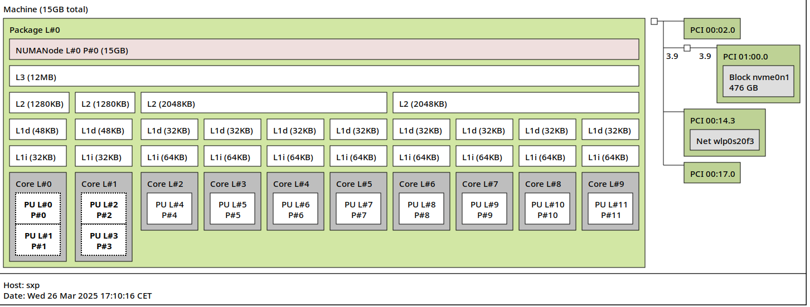

## Roofline
I'm following the [Tutorial: Empirical Roofline Model](https://github.com/RRZE-HPC/likwid/wiki/Tutorial%3A-Empirical-Roofline-Model)

```sh
likwid-topology
```
```
--------------------------------------------------------------------------------
CPU name:	12th Gen Intel(R) Core(TM) i7-1255U
CPU type:	Unknown Intel Processor
CPU stepping:	4
********************************************************************************
Hardware Thread Topology
********************************************************************************
Sockets:		1
Cores per socket:	10
Threads per core:	2
--------------------------------------------------------------------------------
HWThread        Thread        Core        Die        Socket        Available
0               0             0           0          0             *                
1               1             0           0          0             *                
2               0             1           0          0             *                
3               1             1           0          0             *                
4               0             2           0          0             *                
5               0             3           0          0             *                
6               0             4           0          0             *                
7               0             5           0          0             *                
8               0             6           0          0             *                
9               0             7           0          0             *                
10              0             8           0          0             *                
11              0             9           0          0             *                
--------------------------------------------------------------------------------
Socket 0:		( 0 1 2 3 4 5 6 7 8 9 10 11 )
--------------------------------------------------------------------------------
********************************************************************************
Cache Topology
********************************************************************************
Level:			1
Size:			48 kB
Cache groups:		( 0 1 ) ( 2 3 ) ( 4 5 ) ( 6 7 ) ( 8 9 ) ( 10 11 )
--------------------------------------------------------------------------------
Level:			2
Size:			1.25 MB
Cache groups:		( 0 1 ) ( 2 3 ) ( 4 5 ) ( 6 7 ) ( 8 9 ) ( 10 11 )
--------------------------------------------------------------------------------
Level:			3
Size:			12 MB
Cache groups:		( 0 1 2 3 4 5 6 7 8 9 10 11 )
--------------------------------------------------------------------------------
********************************************************************************
NUMA Topology
********************************************************************************
NUMA domains:		1
--------------------------------------------------------------------------------
Domain:			0
Processors:		( 0 1 2 3 4 5 6 7 8 9 10 11 )
Distances:		10
Free memory:		724.945 MB
Total memory:		15702.8 MB
--------------------------------------------------------------------------------
```

`lstopo` chart



```sh
likwid-bench -p
```
```
Number of Domains 5
Domain 0:
	Tag N: 0 1 2 3 4 5 6 7 8 9 10 11
Domain 1:
	Tag S0: 0 1 2 3 4 5 6 7 8 9 10 11
Domain 2:
	Tag D0: 0 1 2 3 4 5 6 7 8 9 10 11
Domain 3:
	Tag C0: 0 1 2 3 4 5 6 7
Domain 4:
	Tag M0: 0 1 2 3 4 5 6 7 8 9 10 11
```

I have only one physical socket my machine, and I'm going to take domain 0 as recommended by the teacher, so with tag `N`.

We want to skip the first 0 and 1 hardware cores used by the OS, so we pin the program on the core number 2 with `taskset -c 2`, my program is single-threaded. We run the peakflops_sp (single precision because my code only use `float` and no `double`). Using 32KB because this is the L1 data cache size, we don't want to further because we are not calculating the memory bandwidth here. We want to use only 1 thread in the benchmark with `:1`
```sh
taskset -c 2 likwid-bench -t peakflops_sp -W N:32kB:1
```
```
Allocate: Process running on hwthread 2 (Domain N) - Vector length 8000/32000 Offset 0 Alignment 1024
--------------------------------------------------------------------------------
LIKWID MICRO BENCHMARK
Test: peakflops_sp
--------------------------------------------------------------------------------
Using 1 work groups
Using 1 threads
--------------------------------------------------------------------------------
--------------------------------------------------------------------------------
Group: 0 Thread 0 Global Thread 0 running on hwthread 2 - Vector length 8000 Offset 0
--------------------------------------------------------------------------------
Cycles:			2894963770
CPU Clock:		2611062958
Cycle Clock:		2611062958
Time:			1.108730e+00 sec
Iterations:		65536
Iterations per thread:	65536
Inner loop executions:	8000
Size (Byte):		32000
Size per thread:	32000
Number of Flops:	8388608000
MFlops/s:		7565.96
Data volume (Byte):	2097152000
MByte/s:		1891.49
Cycles per update:	5.521705
Cycles per cacheline:	88.347283
Loads per update:	1
Stores per update:	0
Load bytes per element:	4
Store bytes per elem.:	0
Instructions:		10485760032
UOPs:			9961472000
--------------------------------------------------------------------------------
```

```sh
taskset -c 2 likwid-bench -t peakflops_sp -W N:32kB:1
```
```
Allocate: Process running on hwthread 2 (Domain N) - Vector length 8000/32000 Offset 0 Alignment 1024
--------------------------------------------------------------------------------
LIKWID MICRO BENCHMARK
Test: peakflops_sp
--------------------------------------------------------------------------------
Using 1 work groups
Using 1 threads
--------------------------------------------------------------------------------
--------------------------------------------------------------------------------
Group: 0 Thread 0 Global Thread 0 running on hwthread 2 - Vector length 8000 Offset 0
--------------------------------------------------------------------------------
Cycles:			2794816360
CPU Clock:		2611196434
Cycle Clock:		2611196434
Time:			1.070320e+00 sec
Iterations:		32768
Iterations per thread:	32768
Inner loop executions:	8000
Size (Byte):		32000
Size per thread:	32000
Number of Flops:	4194304000
MFlops/s:		3918.74
Data volume (Byte):	1048576000
MByte/s:		979.68
Cycles per update:	10.661378
Cycles per cacheline:	170.582053
Loads per update:	1
Stores per update:	0
Load bytes per element:	4
Store bytes per elem.:	0
Instructions:		5242880032
UOPs:			4980736000
--------------------------------------------------------------------------------
```
TODO: que faire des autres perfs

en mode performance !

```sh
taskset -c 2 likwid-bench -t peakflops_sp -W N:32kB:1
```
```
Allocate: Process running on hwthread 2 (Domain N) - Vector length 8000/32000 Offset 0 Alignment 1024
--------------------------------------------------------------------------------
LIKWID MICRO BENCHMARK
Test: peakflops_sp
--------------------------------------------------------------------------------
Using 1 work groups
Using 1 threads
--------------------------------------------------------------------------------
--------------------------------------------------------------------------------
Group: 0 Thread 0 Global Thread 0 running on hwthread 2 - Vector length 8000 Offset 0
--------------------------------------------------------------------------------
Cycles:			4756395192
CPU Clock:		2610062016
Cycle Clock:		2610062016
Time:			1.822330e+00 sec
Iterations:		131072
Iterations per thread:	131072
Inner loop executions:	8000
Size (Byte):		32000
Size per thread:	32000
Number of Flops:	16777216000
MFlops/s:		9206.46
Data volume (Byte):	4194304000
MByte/s:		2301.62
Cycles per update:	4.536052
Cycles per cacheline:	72.576831
Loads per update:	1
Stores per update:	0
Load bytes per element:	4
Store bytes per elem.:	0
Instructions:		20971520032
UOPs:			19922944000
--------------------------------------------------------------------------------
```

We find that `MFlops/s: 9206.46`, that we can round to **9206 MFlops/s**

## Theoritical calculation
The calculation given in the tutorial: `<num_cores> * <op_width> * <num_ops_per_cycle> * <num_fma> * <cpu_frequency>` = `1 * 1 * 1 * 4.70 GHz = 4.70 GFlops/s = 4700 MFlops/s`
that's nonsense...

TODO: okay to have 1 for 32 bits float ?

## Note pour la suite
attention à bien adapter le roofline en fonction du programme qu'on va faire et aux flags d'optimisations.
attention à bien être en -O0 pour le début pour être sûr que il n'y a pas des trucs optimisations liés à avx ou sse qui s'activent
si on utilise que des float -> faire du single precision `sp` !

