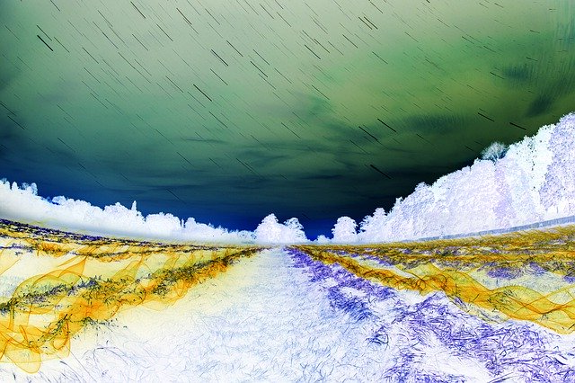

# Rapport HPC Lab 4 - SIMD - Samuel Roland

## Ma machine

Extrait de l'ouput de `fastfetch`
```
OS: Fedora Linux 41 (KDE Plasma) x86_64
Host: 82RL (IdeaPad 3 17IAU7)
Kernel: Linux 6.13.5-200.fc41.x86_64
CPU: 12th Gen Intel(R) Core(TM) i7-1255U (12) @ 4.70 GHz
GPU: Intel Iris Xe Graphics @ 1.25 GHz [Integrated]
Memory: 15.34 GiB - DDR4
Swap: 8.00 GiB
```

## Partie 1 - SIMD sur segmentation
### Baseline
Benchmark du code de départ pour 200 kernels. **1.631s**
```
Benchmark 1: taskset -c 2 ./build/segmentation ../img/sample_640_2.png 200 /tmp/tmp.CklT3lelRc
  Time (mean ± σ):      1.631 s ±  0.017 s    [User: 1.186 s, System: 0.440 s]
  Range (min … max):    1.617 s …  1.655 s    4 runs
```


### Optimisations basiques
Après avoir propagé manuellement les valeurs constantes.
```
Benchmark 1: taskset -c 2 ./build/segmentation ../img/sample_640_2.png 200 /tmp/tmp.oYzAAusKn5
  Time (mean ± σ):      1.625 s ±  0.026 s    [User: 1.194 s, System: 0.425 s]
  Range (min … max):    1.603 s …  1.657 s    4 runs
```
En plus des doubles appels à distance, on fait toujours le carré après l'appel de `sqrt` dans `distance` donc on peut simplifier cela.
```c
float dist = distance(src, new_center) * distance(src, new_center);
```


Sortir les valeurs constantes des boucles comme ici `surface` et `sizeOfComponents`
```c
const int surface = image->width * image->height;
const int sizeOfComponents = image->components * sizeof(uint8_t);
    ...
for (int i = 0; i < surface; ++i) {
```

### Allocations inutiles

On a souvent des cas avec des `malloc` inutiles, comme ici on fait une copie des pixels avant de les envoyer à `distance()` qui ne fait pas de modifications donc la copie est complètement inutile.
```c
    // Calculate distances from each pixel to the first center
    uint8_t *dest = malloc(sizeOfComponents);
    memcpy(dest, centers, sizeOfComponents);

    for (int i = 0; i < surface; ++i) {
        uint8_t *src = malloc(sizeOfComponents);
        memcpy(src, image->data + i * image->components, sizeOfComponents);

        distances[i] = distance(src, dest);
```

On peut ainsi simplifier comme ceci est gagner des `free` aussi
```c
    // Calculate distances from each pixel to the first center
    for (int i = 0; i < surface; ++i) {
        distances[i] = distance(image->data + i * image->components, centers);
    }
```

```
Benchmark 1: taskset -c 2 ./build/segmentation ../img/sample_640_2.png 200 /tmp/tmp.SgMsJxhkr7
  Time (mean ± σ):     195.9 ms ±   1.9 ms    [User: 193.2 ms, System: 2.1 ms]
  Range (min … max):   193.6 ms … 197.5 ms    4 runs
```

Après avoir enlevé les copies inutiles à 3 endroits avant des appels à distance, on a gagne énormenent de temps. On passe de **1.625s** à **0.1959 s** !

### Types entiers au lieu de flottants

En fait, on a pas besoin d'utiliser des float pour la plupart des tailles, ça correspond à des entiers. Les calculs pourraient être accélérés juste parce que les opérations sur les flottants sont plus coûteuses.
```c
float distance(uint8_t *p1, uint8_t *p2) {
    float r_diff = p1[0] - p2[0];
    float g_diff = p1[1] - p2[1];
    float b_diff = p1[2] - p2[2];
    return r_diff * r_diff + g_diff * g_diff + b_diff * b_diff;
}
```
Pour s'en convaincre, on peut dumper les float et voir qu'il sont très souvent déjà entier ou que leur arrondi ne fera pas grande différence.
```c
total_weight = 248323856.000000 and r = 178121952.000000
total_weight = 228217328.000000 and r = 32316158.000000
total_weight = 211624336.000000 and r = 128449384.000000
total_weight = 210208560.000000 and r = 3426519.750000
total_weight = 199563056.000000 and r = 48471224.000000
```

Je pense qu'on aura pas d'overflow avec des `int` car `255^2 * 3 = 195075 < INT_MAX = 2147483647`.

```
Benchmark 1: taskset -c 2 ./build/segmentation ../img/sample_640_2.png 200 /tmp/tmp.nwC7VQYzOW
  Time (mean ± σ):     132.7 ms ±   0.6 ms    [User: 129.9 ms, System: 2.3 ms]
  Range (min … max):   131.9 ms … 133.4 ms    4 runs
```

Ce qui nous amène à **132.7 ms** !

### Refactoring en SIMD
En observant le code de k-means, j'ai d'abord obversé la fonction `distance` qui est très appelée puisqu'elle a 3 références (j'aurai du le mesurer pour être sûr à vrai dire) et celles-ci sont dans des boucles. Le problème c'est que ce n'était pas le code le plus simple transformer tel quel car il travaille sur 3 valeurs RGB ce qui n'est déjà pas une puissance de deux. 
```c
unsigned distance(uint8_t *p1, uint8_t *p2) {
    unsigned r_diff = p1[0] - p2[0];
    unsigned g_diff = p1[1] - p2[1];
    unsigned b_diff = p1[2] - p2[2];
    return r_diff * r_diff + g_diff * g_diff + b_diff * b_diff;
}
```

Faire du SIMD local n'aurait aucun sens, l'overhead de chargement et déchargement de 3 valeurs serait supérieur au gain de faire les 3 soustractions et les 3 carrés d'un coup. Il fallait forcément ressortir le code de `distance` à chaque appel et l'adapter pour traiter plus d'un pixel à la fois. L'appel qui me paraissait le plus simple à refactoriser est le calcul de distances de tous les pixels au premier centre dans `kmeanp_pp`.

La stratégie était donc d'arriver à comparer le plus possible de canaux (RGB) sur une seule itération. Le problème du calcul existant est que la différence entre 2 uint8_t va être soit être négative (d'ailleurs les unsigned ici était temporaire et faux comme ils ne peuvent pas stocker de valeurs négatives, cela est corrigé plus tard). Si elle peut être négative, cela signifie qu'il nous faut un type signé mais qui peut quand même aller à 255, donc on a besoin de prendre des `uint16_t` à la place et donc on peut gérer 2 fois moins de pixels à la fois.

J'ai fait une autre hypothèse sans être sûr qu'elle était valide mathématiquement, les résultats des images ont l'air être correctes à vue. Je suppose que le carré de chaque différence ici n'est utile que pour avoir des différences positives, ainsi si j'arrive à faire des valeurs absolues des résultats des soustractions, alors je peux me passer des carrés. Cependant une valeur absolue n'est pas possible en SIMD, mais GPT 4o m'a donné une astuce. Il est possible de comparer 2 vecteurs SIMD et d'avoir un vecteur résultat contenant la valeur maximum pour chaque index. Pareil pour le minimum.

Donc au final on arrive à rester sur des valeurs positives et avec le type de départ sur 8 bits! Comme dans un `__m256i` on arrive à mettre 32 fois 8 bits, on peut donc gérer 32 canaux à chaque itération et donc **32 pixels sur la boucle générale**!

Note: `mm256onechannel_color` correspond à un vecteur SIMD d'un des 3 canaux RGB d'un pixel (`mm256onechannel_center` c'est pareil mais pour le premier centre), ce morceau est ainsi appelé trois fois.

On voit ici le trick du max et du min, et de la soustraction des valeurs max par min garantissant que la valeur est positive au final.
```c
__m256i max_ab = _mm256_max_epu8(mm256onechannel_color, mm256onechannel_center);  
__m256i min_ab = _mm256_min_epu8(mm256onechannel_color, mm256onechannel_center);  
__m256i abs_diff = _mm256_subs_epu8(max_ab, min_ab);                              
```
Le problème restant étant la taille de la somme. En effet, 3*255 nécessite plus que 8bits pour être stocké, on devrait prendre 16bits. Mon tableau final de distance sera en `u_int16_t`. Je dois donc utiliser `_mm256_unpacklo_epi8` pour transformer nos 8 bits vers des valeurs 16bits.
```c
u_int16_t *distances = (u_int16_t *) malloc(surface * sizeof(u_int16_t));
```

Pour garder 32 différences à la fois et pas en avoir que 16, je gère simplement 2 vecteurs SIMD `dists_hi` et `dists_lo`.
```c
/* Make the 16 low 8 bits integers into 16 times 16 bits integers */              
__m256i partial_abs_diff = _mm256_unpacklo_epi8(abs_diff, _mm256_setzero_si256());
dists_lo = _mm256_add_epi8(partial_abs_diff, dists_lo);                           
/* Same for the 16 high 8 bits integers */                                        
partial_abs_diff = _mm256_unpackhi_epi8(abs_diff, _mm256_setzero_si256());        
dists_hi = _mm256_add_epi8(partial_abs_diff, dists_hi);                           
```

Pour facilement charger toutes les valeurs RGB séparement, j'ai commencer par dupliquer le buffer de l'image dans un format avec 3 vecteurs de `surface` valeurs l'un après l'autre, au lieu des intercalages original. Ce qui me permet de charger un registre `reds` de 32 valeurs depuis `data_r`.

```c
reds = _mm256_loadu_si256((__m256i *) (data_r + i));
```

Voici le même benchmark sur l'image donné, qui nous donne malheusement **151.6ms**, donc **~20ms de plus**...
```
Benchmark 1: taskset -c 2 ./build/segmentation ../img/sample_640_2.png 200 /tmp/tmp.oB6zsFQ5aB
  Time (mean ± σ):     151.6 ms ±   1.4 ms    [User: 148.0 ms, System: 3.1 ms]
  Range (min … max):   149.7 ms … 154.3 ms    10 runs
```

C'est là que je me suis rendu compte des quelques heures d'effort ne donnent aucune amélioration, que j'aurai du benchmarker plus préciser et voir que la fonction `kmeanp_pp` n'était appelée qu'une fois et comptait pour une très faible minorité du temps...

J'ai aussi testé avec des images plus grandes pour voir si cette première parallélisation pouvait avoir un impact à plus large échelle, mais là aussi les résultats sont décevants.

D'abord l'entête de `stb_image` indique que la taille maximum des images est de `INT_MAX`, ce qui empêche de charger des très très grandes images.

```c
// stb_image uses ints pervasively, including for offset calculations.
// therefore the largest decoded image size we can support with the
// current code, even on 64-bit targets, is INT_MAX. this is not a
// significant limitation for the intended use case.
```

Comme précédemment, je mesure mon temps avec `hyperfine`, sur 2 targets pour tester sans SIMD puis avec. Ce qui change c'est l'image et le nombre de kernel.

```sh
> hyperfine -r 3 'taskset -c 2 ./build/segmentation_no_simd ../img/big.png 1 1.png' && hyperfine -r 3 'taskset -c 2 ./build/segmentation_simd ../img/big.png 1 1.png'
...
```

J'ai réussi à générer une image tirée d'un schéma vectoriel exporté en PNG en `18869x10427`, je n'ai pas réussi à charger en plus grande taille, après de multiple essais pour trouver une image grande mais qui ne génère pas d'erreur `too large`... J'ai repris une image 8k de taille `7680x4320` également.

Résultats des lancers sur 4 nombre de kernels différents et 2 images.
| Type | Taille image | Kernels | Temps mesuré |
| --------------- | --------------- | --------------- | --------------- |
| Sans SIMD | `7680x4320` | 10  | 2.486s |
| Avec SIMD | `7680x4320` | 10 | 2.786s |
| Sans SIMD | `7680x4320` | 50  | 5.906s |
| Avec SIMD | `7680x4320` | 50 | 6.674s |
| Sans SIMD | `18869x10427` | 50 | 14.382 |
| Avec SIMD | `18869x10427` | 50 | 14.562s |
| Sans SIMD | `18869x10427` | 1  | 12.773s |
| Avec SIMD | `18869x10427` | 1  |13.043s  |

On a **300ms**, **768ms**, et **180ms** de différence en plus.

Même avec la plus grande image et 1 seul kernel pour le dernier cas, ce qui a priori devrait donner le résultat comme le premier tour devrait être une plus grande portion du temps vu qu'il n'y a que très peu de tours par la suite. On a toujours une différence de **270ms** en plus, on peut supposer que cela ne ve pas beaucoup changer avec des images encore plus grandes, en plus que cela ne deviennent plus tellement réaliste en terme d'usage.

En discutant avec Aubry, nous nous sommes rendus compte que cette approche ne s'avère pas tellement compatible avec la suite des boucles, puisque les centres peuvent changer à chaque pixel, je n'ai pas cherché à l'étendre ou la refactoriser plus loin.

### Résumé des optimisations
| Titre | Temps |
| ------|------- |
| Départ | 1.631s |
| Optimisations basiques | 1.625s|
| Allocations inutiles | 195.9ms |
| Types entiers au lieu de flottants | 132.7ms |
| Refactoring en SIMD | 151.6ms |

### Conclusion de cette première partie
1. Retirer des allocations dans des boucles ça peut vraiment impacter massivement le programme (ici le presque `10x`)
1. Le SIMD c'est compliqué à comprendre, architecturer, mettre en oeuvre et juste à réfléchir
1. Avant de me lancer tête baissée, j'aurai du commencer par benchmarker plus précisément, avec un flamegraph ou des marqueurs likwid, pour savoir quelles étaient les sections les plus lentes et voir le potentiel de vectorisation.

## Partie 2 - propre algorithme de traitement d'image
Je demandais des idées à Copilot d'algorithmes qui faisaient plusieurs calculs pour peut-être voir un bénéfice en SIMD. Après quelques allers-retours, il m'a proposé d'inverser les couleurs et d'appliquer un facteur de niveau de luminosité. Ce facteur pourra être entre -10 et 10 compris afin d'appliquer respectivement un éclaircissement ou un assombrissement. J'ai appelé ma target `weirdimg` parce que je ne sais pas encore trop à quoi ça va ressembler.

Comme demandé j'ai désactivé les optimisations dans cette partie `-O0 -g -Wall`.


Ainsi la commande suivante va générer une image sans changer sa luminosité, on voit donc uniquement l'inversion des couleurs.
```sh
./build/weirdimg ../img/sample_640_2.png 1 10.png
```
 


Ainsi la commande suivante va générer une image plus sombre d'un facteur de 3 (tous les canaux sont multipliés par 3)

```sh
./build/weirdimg ../img/sample_640_2.png -3 10.png
```
 

### Baseline
Une première mesure du code sans SIMD, nous indique **399.2ms** sur l'image 2K avec 2 d'éclaircissement.
```
Benchmark 1: taskset -c 2 ./build/weirdimg ../img/forest_2k.png 2 /tmp/tmp.aRRZAwwgEs
  Time (mean ± σ):     399.2 ms ±   1.0 ms    [User: 390.5 ms, System: 7.8 ms]
  Range (min … max):   398.0 ms … 400.6 ms    10 runs
 
```

### SIMD

